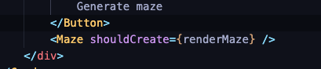

# 2d-mazecreator-algorithm

This is a simple 2D maze creator using Depth First algorithm

# Requirements

- react-p5 https://www.npmjs.com/package/react-p5

# Implementing

- Import in your code (default exported).  

- In the example it is imported as Maze
- Pass a shouldCreate: bool prop -> false just renders the grid -> once true it will start creating the maze
